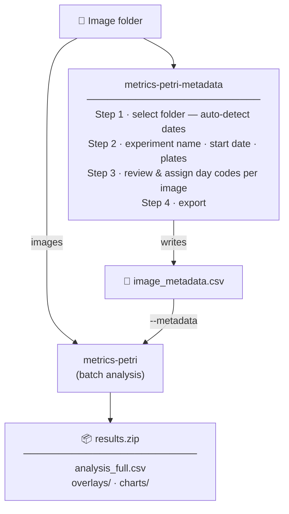

# metrics-petri


[](https://pepy.tech/projects/metrics-petri)


Macroscopic image analysis for fungal colony growth on petri dishes.

`metrics-petri` measures how a sample expands, whether its edge stays smooth or roughens, when cracks appear, and how centre-to-edge texture evolves over time. It turns a folder of time-series images into physical measurements (mm², mm, day⁻¹) with overlay visualisations.

## Workflow



`metrics-petri-metadata` is optional — `metrics-petri` can run on images alone, but supplying metadata enables growth-rate calculations and day-coded charts.

The repository ships three entry points:

| Entry point | Install | Use |
| --- | --- | --- |
| `metrics-petri` | `pip install metrics-petri` | CLI batch pipeline |
| `metrics-petri-metadata` | `pip install metrics-petri` | Desktop GUI for building `image_metadata.csv` |
| `metrics-petri-crop` | `pip install metrics-petri` | CLI crop multi-dish images into per-dish PNGs |

---

## Repository setup

### Prerequisites

- Python 3.10 or later
- `make` (standard on macOS/Linux)

### Clone and install

```bash
git clone https://github.com/rotsl/metrics-petri.git
cd metrics-petri
make install        # create venv, install deps, verify model checkpoint
```

`make install` creates a virtual environment, installs Python dependencies, and downloads the UNet checkpoint to `models/best_area_w_0.7.pt` if it is not already present.

### Install from PyPI

```bash
python3.12 -m venv petrienv
source petrienv/bin/activate
pip install --upgrade pip
pip install metrics-petri
```

PyTorch is pulled in automatically. For a CPU-only install without CUDA drivers:

```bash
pip install torch --index-url https://download.pytorch.org/whl/cpu
pip install metrics-petri
```

### Model checkpoint

The checkpoint `models/best_area_w_0.7.pt` is tracked in this repository and downloaded automatically by `make install`. It was trained and validated using [**petrimodel**](https://github.com/rotsl/petrimodel) — a companion repository that trains and evaluates the SmallUNet on annotated petri-dish images, hosts the LabelMe JSON annotations and sweep plots, and includes a PySide6 desktop tool for manual diameter validation against model-generated masks.

To fetch the checkpoint independently:

```bash
make download-model
```

To use a custom checkpoint:

```bash
UNET_MODEL=/path/to/checkpoint.pt make run-cli INPUT=input_images/
```

---

## CLI usage (batch pipeline)

```bash
# Analyse a folder of images
metrics-petri input_images/

# Specify output path
metrics-petri input_images/ --output results/run01.zip

# Supply experiment metadata for growth rate calculations
metrics-petri input_images/ --metadata input_images/image_metadata.csv

# Adjust segmentation threshold
metrics-petri input_images/ --threshold 0.45
```

Output is a single ZIP containing `analysis_full.csv`, `analysis_full.json`, per-image overlays, and growth-curve charts with day codes on the x-axis.

Full CLI documentation: [`metrics_petri/pipelinesam/README.md`](metrics_petri/pipelinesam/README.md)

---

## Dish cropper

`metrics-petri-crop` detects and crops individual petri dishes from photos where several dishes were captured together in a single image (2–8+ dishes per photo). It is a standalone utility — independent of the analysis pipeline.

```bash
# Crop all images in a folder
metrics-petri-crop -i input_images/

# Single image with date prefix on output filenames
metrics-petri-crop -i photo.jpg --date 06/Feb

# Save debug overlay showing detected circles
metrics-petri-crop -i input_images/ --debug

# Custom output directory
metrics-petri-crop -i input_images/ -o cropped/
```

Output is saved to a `cropped/` subfolder beside the input by default. Only fully visible dishes are extracted; partial dishes at image edges are ignored.

Full option reference: `metrics-petri-crop --help`

---

## Notebook walkthrough

```bash
make run-notebook
```

This uses the venv created by `make install` and opens `notebooks/example_metrics-petri.ipynb` in JupyterLab. The notebook traces the full pipeline — mask inference, dish detection, crack analysis, and growth metrics — with inline plots at each step.

The notebook is not distributed with the pip package. Clone the repository to use it.

---

## Makefile targets

| Target | Description |
| --- | --- |
| `make install` | Create venv, install deps, download model |
| `make download-model` | Download UNet checkpoint to `models/` if missing |
| `make model-status` | Check whether the checkpoint is present |
| `make run-cli INPUT=path/` | Run batch CLI on a folder |
| `make run-notebook` | Open the example notebook in JupyterLab |
| `make build-package` | Build wheel and sdist for PyPI |
| `make publish-pypi` | Upload to PyPI with twine |
| `make clean` | Remove venv, caches, build artefacts |

---

## Repository layout

```text
metrics-petri/
├── metrics_petri/          # Python namespace package
│   ├── __init__.py         # version single-sourced here
│   ├── _model.py           # canonical SmallUNet architecture
│   ├── _paths.py           # shared model-path resolution
│   ├── pipelinesam/        # CLI batch pipeline (metrics-petri)
│   │   ├── pipeline.py
│   │   ├── cli.py
│   │   ├── dish_cropper.py
│   │   ├── image_metadata_gui.py
│   │   └── model_small_unet.py
│   └── models/             # UNet checkpoint (bundled in wheel)
│       └── best_area_w_0.7.pt
├── notebooks/              # Development notebooks
│   └── example_metrics-petri.ipynb
├── tests/                  # pytest suite (test_metrics.py, test_metadata.py)
├── input_images/           # Source images (gitignored)
├── outputs/                # Analysis outputs (gitignored)
└── pyproject.toml
```

---

## Measured features

| Feature | Unit |
| --- | --- |
| Colony area | mm² |
| Equivalent diameter | mm |
| Perimeter | mm |
| Circularity | — |
| Eccentricity | — |
| Edge roughness | — |
| Texture entropy | bits |
| Crack area / coverage | mm² / % |
| Crack count | — |
| Relative growth rate | day⁻¹ |
| Area growth rate | mm² day⁻¹ |

Scale is derived from the detected dish circumference (default 90 mm). No calibration target required.

---

## Connected projects

| Project | Description |
| ------- | ----------- |
| [**petrimodel**](https://github.com/rotsl/petrimodel) | Trains and evaluates the SmallUNet used by `metrics-petri`. Includes LabelMe JSON annotations, training data, sweep plots, trained checkpoints, and a PySide6 desktop tool for manual diameter validation against model-generated masks. |
| [**Automator**](https://github.com/rotsl/Automator) | Robotic imaging system at The Sainsbury Laboratory, Norwich. Photographs QR-labelled petri dishes automatically at set intervals over the course of an experiment. Images produced by Automator are the intended input for `metrics-petri`. Documentation: [rotsl.github.io/Automator](https://rotsl.github.io/Automator/) |

---

## License and citation

MIT — see [`LICENSE`](LICENSE).

```bibtex
@software{Rohan_R_Metrics_Petri_petri_2026,
author = {{Rohan R}},
title = {{Metrics Petri: petri dish colony segmentation and morphometric analysis}},
url = {https://github.com/rotsl/metrics-petri},
version = {2.1.0},
year = {2026}
}
```

Machine-readable citation: [`CITATION.cff`](CITATION.cff)
